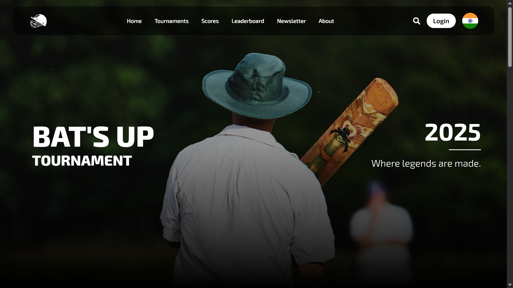
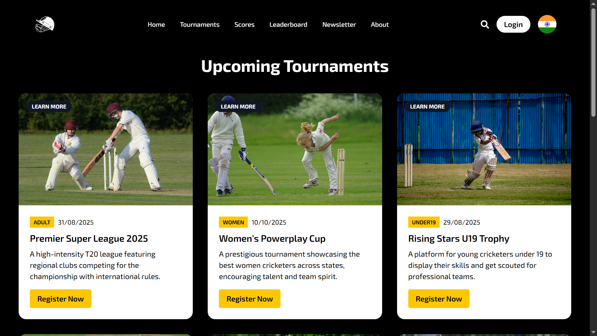
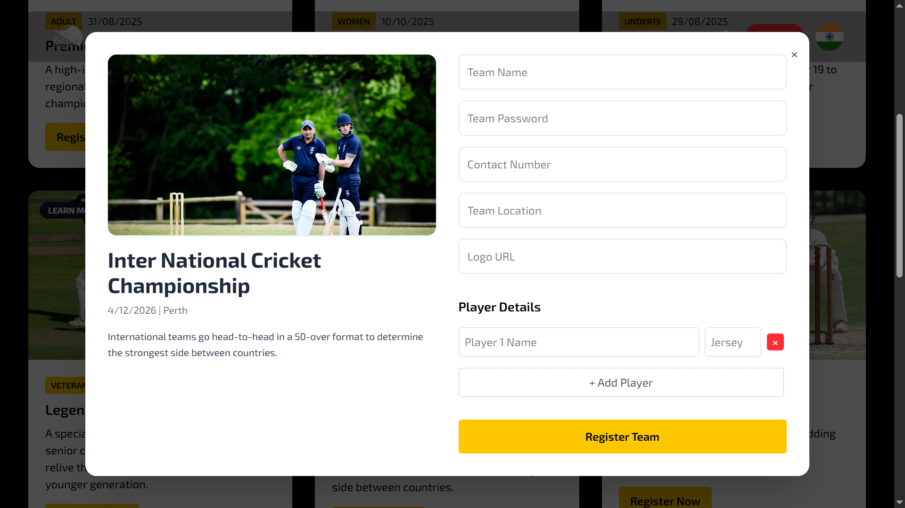
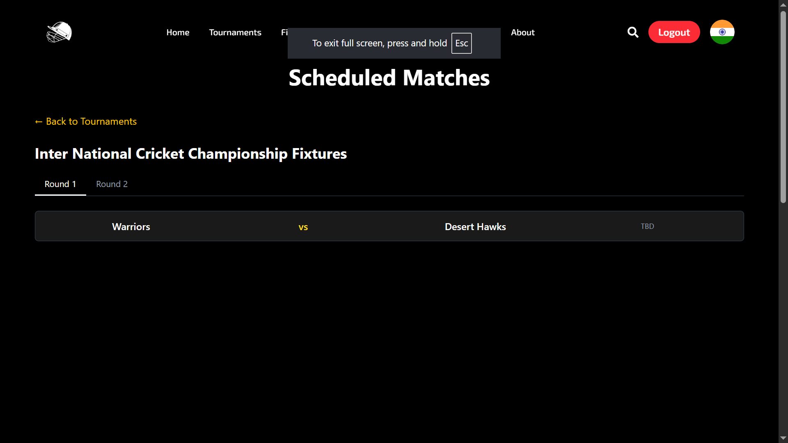
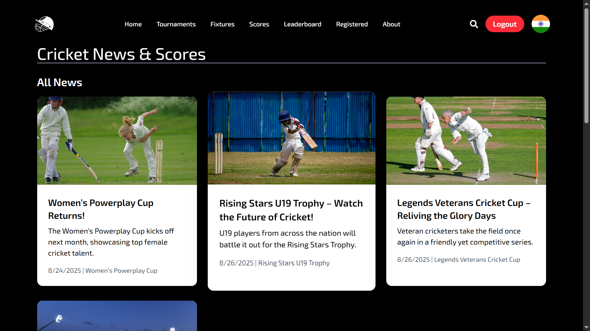

<div align="center">

<br/>

<a href="https://github.com/Madeshmadmax7/BatsUp">
  
</a>


<br/>
<br/>


<br/>
<br/>



<br/>

**BatsUp Manager is a full-stack cricket tournament management platform built using React, Spring Boot, Tailwind CSS, and MySQL. It streamlines tournament organization, player statistics tracking, team management, match scheduling, analytics, and communication through a modern responsive interface backed by scalable REST APIs and relational database architecture.**

<br/>

<p align="center">

<a href="#features">
  
</a>

<a href="#system-architecture">
  
</a>

<a href="#technology-stack">
  
</a>

<a href="#repository-setup">
  
</a>

</p>

</div>

---

## Overview

BatsUp Manager combines a React frontend, Spring Boot backend, Tailwind CSS styling, and MySQL database into a unified platform capable of managing tournaments, tracking player statistics, scheduling matches, organizing teams, broadcasting updates, and visualizing tournament insights in real time.

<br/>


<div align="center">


</div>

<br/>

Experience the complete tournament management workflow including match scheduling, tournament analytics, team management, and newsletter operations through a modern responsive interface.

<br/>

<table width="95%">
<tr>

<td width="50%" valign="top">

## Why BatsUp?

- Comprehensive tournament management
- Real-time player statistics tracking
- Interactive team management
- Match scheduling and organization
- Analytics and tournament insights
- Responsive web design
- Secure REST API integration
- Fast and scalable architecture

</td>

<td width="50%" valign="top">

## Built With

- **Frontend:** React · Tailwind CSS
- **Backend:** Spring Boot · Spring MVC
- **Database:** MySQL
- **Routing:** React Router DOM
- **Build Tool:** Vite
- **Language:** Java · JavaScript
- **Infrastructure:** GitHub · Maven · NPM

</td>

</tr>
</table>

---

# Features

## Match Scheduling

<table width="100%">
<tr>
<th width="50%" align="center">Tournament Register</th>
<th width="50%" align="center">Team Registering</th>
</tr>

<tr>
<td align="center" valign="top">



</td>

<td align="center" valign="top">



</td>
</tr>
</table>

<br/>

The scheduling engine enables organizers to create fixtures, assign venues, manage match timings, and monitor tournament progression efficiently.

### Core Capabilities

- Match scheduling
- Fixture management
- Venue assignment
- Team allocation
- Schedule updates
- Match tracking
- Tournament progression
- Automated organization

---

## Tournament Analytics

<div align="center">



</div>

<br/>

Advanced analytics provide insights into tournament progress, team standings, player performances, rankings, and overall competition statistics.

### Analytics Features

- Tournament rankings
- Team performance analysis
- Match insights
- Statistics dashboard
- Historical records
- Progress monitoring
- Performance comparison


---

## Team Management

<div align="center">


</div>

<br/>

BatsUp includes intelligent team management systems capable of visualizing squad composition, player roles, team standings, performance metrics, and tournament participation records.

### Management Features

- Squad composition tracking
- Player role assignments
- Team performance metrics
- Team standings visualization
- Match history management
- Team statistics
- Performance analysis
- Tournament participation records

---

## Newsletter Management

<div align="center">



</div>

<br/>

The newsletter system enables administrators to share tournament announcements, match updates, schedules, and important information with participants and audiences.

### Newsletter Features

- Tournament announcements
- Match updates
- Event notifications
- Newsletter campaigns
- Audience engagement
- Information broadcasting
- Schedule reminders
- Communication management

---

# System Architecture

```text
 ┌──────────────────────────┐
 │      React Frontend      │
 │  Tailwind CSS Interface  │
 └────────────┬─────────────┘
              │
           REST API
              │
              ▼
 ┌──────────────────────────┐
 │     Spring Boot API      │
 │  Business Logic Layer    │
 │ CRUD Operations          │
 └────────────┬─────────────┘
              │
              ▼
 ┌──────────────────────────┐
 │        MySQL DB          │
 │ Tournament Data Storage  │
 └──────────────────────────┘
```

---

# Technology Stack

| Frontend | Backend | Database | UI Components | Development |
|:---|:---|:---|:---|:---|
| React.js | Spring Boot | MySQL | Lucide React | Maven |
| JavaScript | Spring MVC | MySQL Workbench | React Icons | ESLint |
| HTML5 | Spring Data JPA | Relational Database | Tailwind CSS | Postman |
| CSS3 | REST APIs | MySQL Server | Responsive UI | Git |
| Tailwind CSS | Java 17 | SQL Queries | Component Library | GitHub |

---

# Application Flow

```text
User Interaction
      │
      ▼
React Components
      │
      ▼
REST API Requests
      │
      ▼
Spring Boot Controllers
      │
      ▼
Service Layer
      │
      ▼
Repository Layer
      │
      ▼
MySQL Database
      │
      ▼
Response Processing
      │
      ▼
User Dashboard
```

---

# Project Structure

```bash
BatsUp/
│
├── src/
│   ├── components/
│   ├── pages/
│   ├── services/
│   ├── hooks/
│   ├── utils/
│   ├── styles/
│   ├── App.jsx
│   └── main.jsx
│
├── public/
├── screenshots/
│
├── package.json
├── vite.config.js
├── index.html
└── README.md
```

---

# Modules

| Module | Description |
|:---|:---|
| Tournament Manager | Tournament creation and management |
| Team Management | Team registration and squad management |
| Match Scheduling | Fixture planning and scheduling |
| Tournament Analytics | Rankings and performance analysis |
| Newsletter Management | Announcements and updates |
| Authentication | Secure user access |
| Player Profiles | Statistics and records |
| Responsive UI | Mobile and desktop support |

---

# Deployment

| Service | Platform |
|:---|:---|
| Frontend | Vercel / Netlify |
| Backend | Render / Railway |
| Database | MySQL |
| Build Tool | Maven + Vite |
| Source Control | GitHub |

---

# Repository Setup

<details>
<summary><b>Installation & Setup</b></summary>

```bash
# Clone the repository
git clone https://github.com/Madeshmadmax7/BatsUp.git

# Navigate to project directory
cd BatsUp

# Install dependencies
npm install
```

</details>

---

<details>
<summary><b>Development Server</b></summary>

```bash
# Start development server
npm run dev

# Runs at
http://localhost:5173
```

</details>

---

<details>
<summary><b>Production Build</b></summary>

```bash
# Create optimized production build
npm run build

# Preview build
npm run preview
```

</details>

---

<details>
<summary><b>Linting</b></summary>

```bash
# Run ESLint
npm run lint

# Fix issues
npm run lint -- --fix
```

</details>

---

# Environment Configuration

Create a `.env` file in the root directory:

```env
VITE_API_URL=http://localhost:8080/api
```

---

# API Integration

The frontend communicates with Spring Boot services using REST APIs.

Example:

```javascript
import axios from "axios";

const api=axios.create({
  baseURL:import.meta.env.VITE_API_URL
});

export default api;
```

---

# Performance Optimization

- Component-based architecture
- Optimized REST API communication
- Tailwind CSS utility optimization
- Code splitting and lazy loading
- Responsive image delivery
- Fast Vite production builds
- Efficient state management
- Optimized asset loading

---

# Browser Support

- Chrome (Latest)
- Firefox (Latest)
- Safari (Latest)
- Edge (Latest)
- Mobile Browsers

---

# Screenshots Directory

```text
screenshots/
├── dashboard.gif
├── match-scheduling.png
├── fixture-management.png
├── tournament-analytics.png
├── team-management.png
└── newsletter.png
```

---

<div align="center">


<br/>


<br/>

### Built with React • Spring Boot • Tailwind CSS • MySQL

Star this repository if you found BatsUp useful

</div>
